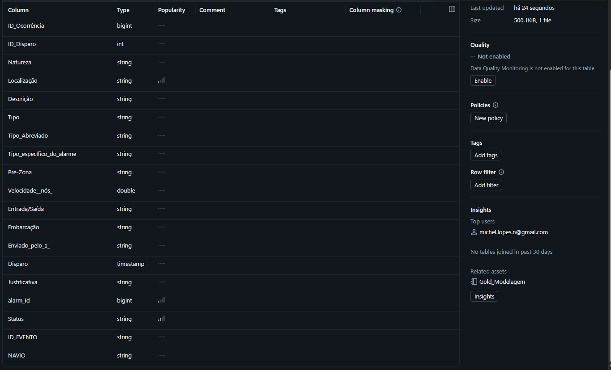
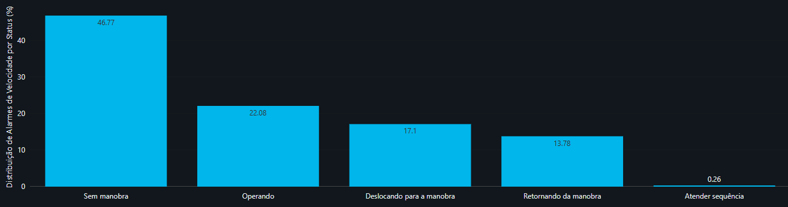
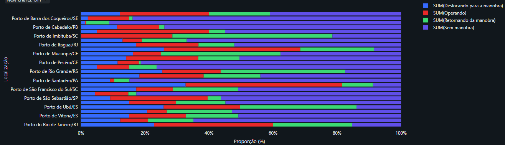

# Análise de Causas Raiz de Alarmes de Velocidade na Operação de Rebocadores

## 1. Contexto do Problema e Objetivos da Análise

### Contexto Operacional
Na operação de rebocadores marítimos, os alarmes de velocidade excessiva geram alertas constantes para a central de monitoramento. Contudo, existe uma distinção crucial na dinâmica da navegação:
1. **Deslocamento (Autonomia do Comandante):** O rebocador navega de ou para o local do evento. O comandante possui controle direto sobre a velocidade da embarcação.
2. **Operação (Restrição Externa):** O rebocador atua diretamente no navio assistido. A velocidade é imposta pelas exigências do prático, pela inércia do navio ou pelas condições de manobra no canal.

### Objetivo
Analisar os registros de alarmes de velocidade e cruzá-los com o histórico de manobras para identificar a causa raiz dos disparos, respondendo às seguintes perguntas:
* Qual a proporção de alarmes acionados em momentos de autonomia (deslocamento) versus restrição operacional (manobra com navio)?
* Quais portos e terminais concentram o maior volume de infrações em deslocamento para ações orientativas e preventivas direcionadas?

---

## 2. Conjunto de Dados e Ingestão

A análise utiliza duas bases de dados operacionais anonimizadas:
* **Base de Alarmes:** Registros de telemetria contendo data/hora do disparo, embarcação, localização (porto), tipo de alarme e velocidade medida pelo sensor.
* **Base de Manobras:** Histórico contendo os horários de início e fim dos deslocamentos e das operações comerciais de cada rebocador.

---

## 3. Catálogo de Dados e Dicionário de Variáveis

Tabela consolidada final utilizada para a extração dos resultados e gráficos de análise:

| Nome do Campo | Tipo de Dado | Descrição e Regras de Negócio |
| :--- | :--- | :--- |
| **alarm_id** | bigint | Identificador único do alarme registrado. |
| **Embarcação** | string | Nome padronizado do rebocador da frota. |
| **Localização** | string | Porto ou terminal onde ocorreu o disparo do alarme. |
| **Disparo** | timestamp | Data e hora exatas da ocorrência da infração. |
| **Velocidade__nós_** | double | Velocidade registrada no instante do disparo (filtrada até o limite estatístico de 22,96 nós). |
| **Status** | string | **Campo Chave da Análise:** Classificação do contexto no momento do disparo (*Deslocando para a manobra*, *Operando*, *Retornando da manobra*, *Atender sequência* ou *Sem manobra*). |
| **ID_EVENTO** | bigint | Identificador da manobra associada (nulo caso não haja manobra ativa no momento). |
| **NAVIO** | string | Nome do navio atendido durante o evento associado. |

---

## 4. Regras de Processamento e Integração dos Dados

Para permitir o cruzamento correto dos eventos e a classificação dos status, foram aplicadas as seguintes regras de transformação:

1. **Fatiamento Temporal dos Eventos:** A linha do tempo de cada manobra foi fatiada em janelas contínuas:
   * **Deslocando para a manobra:** Do início do deslocamento até o início da operação.
   * **Operando:** Do início até o fim da operação comercial.
   * **Retornando da manobra:** Do fim da operação até o fim do deslocamento.
   * **Atender sequência:** Intervalos operacionais de até 30 minutos entre frotas.
2. **Cruzamento Temporal:** O instante exato do alarme (`Disparo`) foi cruzado com os intervalos de tempo calculados para atribuir o status correspondente a cada infração.

---

## 5. Qualidade e Tratatamento dos Dados

Para garantir que a análise refletisse a realidade operacional, foram aplicadas etapas de tratamento de qualidade:

1. **Padronização de Nomes de Embarcações (Fuzzy Matching):** Ajuste de divergências de grafia nos nomes dos rebocadores entre a base de alarmes e a base de manobras para viabilizar o cruzamento.
2. **Remoção de Outliers de Leitura (Regra Estatística 3-Sigma):** Eliminação de ruídos de medição nos sensores GPS de velocidade:
   * **Média de Velocidade ($\mu$):** 8,50 nós
   * **Desvio Padrão ($\sigma$):** 4,82 nós
   * **Limite Superior ($\mu + 3\sigma$):** **22,96 nós**. Valores registrados acima deste limite foram desconsiderados por representarem falhas temporárias de leitura dos sensores.

---

## 6. Resultados e Análise dos Alarmes

### 1. Distribuição Geral dos Alarmes por Contexto Operacional
A classificação dos alarmes gerou o seguinte panorama consolidado da frota:

* **Foco Principal de Ação (Deslocamentos Acionáveis):** **31,14%** dos alarmes ocorreram em fases onde o comandante tem controle direto da navegação (17,10% em deslocamento inicial, 13,78% no retorno e 0,26% em atendimento de sequência). Recomenda-se à gestão orientar os comandantes a iniciarem as navegações com maior antecedência, eliminando a necessidade de navegação acima do limite para cumprir horários.
* **Alarmes Justificáveis (Em Operação):** **22,08%** dos disparos ocorreram com o status *Operando*. Como a velocidade nessas etapas é imposta pelo navio assistido ou por determinações do prático, esses alarmes são justificáveis e não devem gerar cobranças aos comandantes.
* **Oportunidade de Enriquecimento (Sem Manobra):** **46,77%** dos alarmes ocorreram fora de eventos comerciais cadastrados (movimentações de abastecimento, manutenção ou troca de base).

### 2. Análise Regional e Comparativa por Porto (100% Empilhado)
A distribuição percentual por porto demonstrou variações significativas no perfil das infrações:

* **Ações Direcionadas por Porto:** Portos como **Santos/SP** e **Salvador/BA** apresentaram maiores proporções de alarmes em fases de deslocamento. Esse achado permite que a gestão direcione treinamentos e conscientização prioritariamente às equipes dessas localidades.

---

## 7. Autoavaliação e Conclusões

* **Conclusão Geral:** O estudo atingiu seu objetivo ao isolar o que é infração gerenciável (31,14%) do que é exigência de manobra (22,08%), fornecendo à gestão um direcionamento claro de onde atuar.
* **Dificuldades Encontradas:** Tratamento de inconsistências de grafia nos nomes das embarcações entre os sistemas e estruturação do cruzamento temporal entre pontos no tempo (alarmes) e janelas contínuas (manobras).
* **Trabalhos Futuros:** Para mapear os 46,77% de alarmes categorizados como *Sem manobra*, recomenda-se integrar no futuro as bases de dados de ordens de serviço de manutenção, abastecimento e transferências de frota.